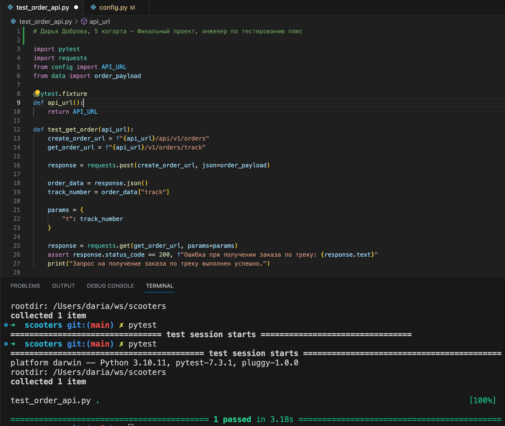

# Автотесты для заказов

Этот проект содержит автотесты для проверки функциональности заказов.

## Установка зависимостей

Для установки зависимостей выполните следующую команду:

```bash
pip3 install pytest requests
```

## Конфигурация

В файле `config.py` укажите URL вашего API в переменной `API_URL`. 

Пример:

```python
API_URL = "https://3355bca4-5c96-490a-8450-d0bca9187f1a.serverhub.praktikum-services.ru"
```

## Запуск автотестов

Для запуска автотестов выполните следующую команду:

```bash
pytest
```

Так выглядит успех:
